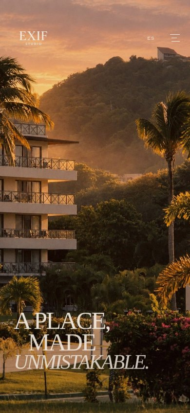
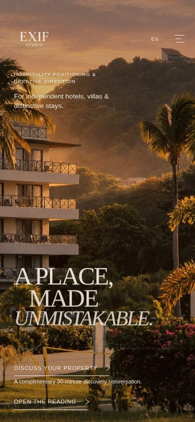
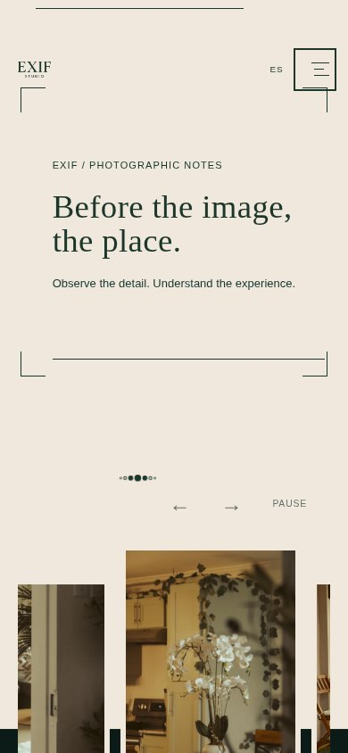

# EXIF — Creative direction reset

Creative review · 9 October 2026 · **Research and recommendations only. No website changes.**

## The judgment

**EXIF already has its three strongest moments. The newer work has put explanations between them.** The photographic loader and hero establish anticipation; the gallery makes a place feel inhabited; Observe / Decide / Create turns attention into a spatial decision. Their value comes from composition and subject matter as much as motion.

I recommend an edited homepage: **loader → hero → gallery → Observe / Decide / Create → Dear EXIF.** Remove the new typographic introduction, empty photographic frame, language exercise and closing promotional invitation. Remove the secondary hero link and repeated discovery-call promise. Keep one clear commercial invitation, “Discuss your property,” in the hero and the existing drawer.

This also requires challenging the original. Its “Why your property?” comparison postpones the gallery, and its recognition sequence starts another argument after the cards. **Move the original comparison intact to Approach; move the recognition sequence intact to What We Do.** Both become consequential openings to the questions those pages answer. These are explicit proposed changes of placement, not claims that every original position can remain unchanged. The original components themselves remain protected; neither relocation is authorized for implementation by this document.

### Evidence: the mobile hero lost its silence

| Protected original | Current prototype |
| --- | --- |
|  |  |

The original lets the palm, building, hills and light occupy the upper field. Its title sits low, so the photograph has time to establish a place before language intervenes. The prototype introduces two blocks of positioning copy above it, lifts the title, then puts a consultation link, a free-call promise and “Open the reading” below it. The photograph has become the background for several instructions.

**Keep the original headline geometry, image crop and color behavior. Remove the audience paragraph, “Open the reading,” and the free-call promise from this composition.** Commercial clarity needs one quiet category caption and one primary invitation. Proposed caption: “Creative direction for independent hospitality.” That is surrounding copy, not a new headline or permission to redraw the protected hero.

## What the browser comparison establishes

I rendered isolated archives of four exact Git checkpoints, scrolled every homepage from arrival to footer in desktop and mobile Chromium, and revisited selected compositions. These were fresh local browser visits to the archived source, not inspections of a deployed Cloudflare build. External HTTPS requests, including the Google Fonts request, were blocked equally in all comparisons; local assets remained available. Fallback body typography can affect copy wrapping and page heights on a deployed site. I opened the drawer, tested its hover and dismissal, advanced the gallery, selected all three original cards, exercised the new service artifact, and inspected all four current inner pages. A supplementary reduced-motion inspection tested the study selector, reading slider, service emphasis/format controls and Approach disclosure. The [evidence index](reset-evidence/README.md) links screenshots, recordings and action logs.

| Version | Verified Git SHA | Desktop homepage height | Mobile homepage height | Gallery chapter begins: desktop / mobile |
| --- | --- | ---: | ---: | ---: |
| Protected original | `9a02ab7b17f779d6a2e5190731d428508c3da7ff` | 8,118 px | 7,096 px | 3,490 / 2,460 px |
| V2 | `017ee32f22b7c1197251e1059b9121977d070fb5` | 10,417 px | 9,463 px | 4,318 / 3,143 px |
| V3 | `337ee2dc22937064d86fe648052daa6b5e39e4f2` | 10,682 px | 9,610 px | 4,416 / 3,255 px |
| Current prototype | `7534e259b69175423f5e68462d9cbffa1fe945a7` | 11,032 px | 9,950 px | 4,766 / 3,595 px |

At **1440 × 900 desktop** and **390 × 844 mobile**, the prototype is approximately **36% and 40% longer** than the original. Its added introduction and passage place **1,135 additional mobile pixels** before the gallery chapter. Even the original puts 1,616 pixels between the end of the mobile hero and that chapter; the prototype puts 2,751. These are measured document positions, not time-on-page, eye tracking, or the exact instant a photograph finishes revealing.

V2 contributes the largest increase: positioning, service explanation, study and invitation. V3 adds chapter signals, selectors and explanatory states. The prototype inserts another threshold before a gallery that already has entrance choreography. The progression increases the amount of interface without increasing the amount of photographic evidence.

### What is exceptional, and why

| Original component | What actually works | Creative decision |
| --- | --- | --- |
| Photographic loader and handoff | The small image window establishes a scale smaller than the screen. Its photographic changes create anticipation before the hero takes over. The subject arrives before the studio explains itself. | Preserve the actual sequence, timing and handoff. Treat loader and hero as one arrival, not two separate demonstrations. |
| Desktop hero | The large title crosses the photographic boundary; its cream/green behavior makes the frame physically matter. The italic final line changes the voice. The margins allow the image and words to negotiate dominance. | Preserve scale, alignment, movement, crop and boundary behavior. Remove the new competing marginal explanations. |
| Mobile hero | An immersive photograph and a low title produce a markedly different composition from desktop. Its open upper field is useful silence, not unused space. | Recover that hierarchy. Do not fill the upper field with the desktop sidebar copy. |
| Gallery | Unequal frames, cream mats, reflected interior light, orchids, a hammock, a restaurant and later exterior photographs communicate lived experience. The deep green rise ties images to the cards below. The next control changes the photographic sequence. | Give this the second major movement. Preserve assets, order, crops, movement and controls. Keep the current accessible pause control. |
| Observe / Decide / Create | Selecting a card redistributes real space. A decision becomes visible through width and emphasis; the folded neighbors explain that other choices remain. | Keep the original mechanism and visual prominence. Do not surround it with another three-choice methodology exercise. |
| Editorial drawer and optical glass | Opening navigation changes the whole scene: oversized destinations occupy an editorial field while the visible background is optically separated. It feels like entering another plane of the same site. | Preserve appearance, optical layers, opening/closing choreography and functional accessibility. Keep all five current destinations. |
| Founder’s letter | Its lowercase voice and account of learning through hospitality work are specific and human. It speaks more persuasively than “A personal perspective. A considered responsibility.” | Preserve the full original bilingual letter, not merely a link to it. Make it Studio’s emotional center. |

See the [original desktop hero](reset-evidence/original-desktop/03-hero.jpg), [original gallery](reset-evidence/original-desktop/gallery.jpg), [expanded Create card](reset-evidence/original-desktop/card-create.jpg) and [original optical drawer](reset-evidence/original-desktop/04-drawer.jpg).

### What is diluting the experience

**The positioning block is another hero.** Its enormous “Understand what makes a place worth choosing…” statement occupies a new cream field after the original comparison, repeats the commercial explanation already introduced above, and offers two more links. It makes the visitor restart the premise. Delete the whole block from Home; retain the necessary service information on What We Do.

**The photographic passage contains no photograph.** It frames “Before the image, the place,” another caption and a rule. Then the visitor meets the gallery’s own signal and controls. The mobile capture shows the cost clearly: frame, blank interval, dots, controls, then photographs. Calling it photographic does not give it a photographic purpose. Delete it completely.

**The study repeats the card deck without its spatial intelligence.** I selected Decide: the displayed explanation says to choose a verified detail, but the material remains a language exercise. It does not reveal a particular detail, evidence or consequence. Retire this module rather than relocating its redundancy.

**The service prototype is still a presentation of assertions.** Examine / Define / Translate changes the hypothetical courtyard description and a production specification. I tested all three states. The courtyard is never seen, and no resulting photograph or designed communication can be inspected. The disclaimer is honest; the demonstration nevertheless asks the visitor to imagine the proof. The older slider, emphasis choices and format choices add more controls below the new one. They repeat the same conceptual explanation in different interface forms. Remove these added demonstrations.

**The closing discovery invitation competes with Dear EXIF.** The large new invitation repeats “Discuss your property” and the free-call promise just before the protected correspondence ending. It creates two consecutive endings. Delete the promotional section; preserve Dear EXIF. Place the call details on Inquire, where they answer a practical question.

**The original also over-explains before and after its strongest images.** “Why your property?” is a good perception sequence in an expensive position on Home. The recognition poster/rail is commercially useful but begins another long chapter after the card experience. Rehome both intact, so Home can sustain its film while the inner pages do substantive work.

## One cinematic concept: A place, seen closely

> Enter through a small photographic window. Let it become a place. Stay with the light, reflections and ordinary moments that make hospitality recognizable. Only then reveal how EXIF turns that attention into direction. Finish with a human invitation to write.

This is the internal creative direction, **not a replacement for “A place, made unmistakable.”**

The film has three dominant movements: **arrival, inhabitation, interpretation**. Each has a different scale. Arrival moves from the loader’s small window to the hero’s assertive composition. Inhabitation gives the photographs control, with words receding. Interpretation makes a choice tangible through the original card deck. Dear EXIF is the quiet coda.

The gallery contains hospitality photographs from previous professional experience across places. It must retain that provenance. This concept does not pretend they are a continuous tour of one property or an EXIF client case. The continuity is a way of seeing: interior detail, shared space, atmosphere, human use.

The palette already supplies a film language: cream as the margin around an image, green as the space in which that image is held, light and shadow inside the photography. Keep these relationships. Do not introduce decorative grain, cinematic black bars, ambient sound, a new video hero, or another parallax system. Existing motion has a job; added motion must reveal new information to earn one.

### What the five references teach this direction

These are interpretations of the **completed live desktop/mobile investigation from 03:25–03:47 UTC on 9 October**, revisited through its evidence. They are not claims of a new live visit today. All five references loaded during that research. The [original interaction study](../research/EXIF-INTERACTION-REFERENCE-STUDY.md) contains the action logs, recordings, access details and technical observations.

| Reference | Specific creative quality | EXIF application | What I reject |
| --- | --- | --- | --- |
| [Tengile MalaMala](https://tengilemalamala.com) | An elephant photograph and a smaller leopard frame produce unequal scales and a definite subject. Bounded movement remains inside image crops. Text never substitutes for the image. | Make the existing gallery the photographic event; retain asymmetry and let photographs carry atmosphere. [Evidence](reset-evidence/reference-revisits/tengile-desktop-scroll-02.png). | An empty frame as an imitation of photographic storytelling; parallax applied to everything. |
| [White Desert](https://white-desert.com) | A sustained visual world carries the viewer between camps through horizontal movement. The effect also persists in a demanding mobile pinned scene. | Preserve visual continuity through the existing gallery’s green rise into the cards, in normal page flow. [Mobile evidence](reset-evidence/reference-revisits/white-mobile-home-scroll-18.png). | Importing its long pin, travel distance or clipped narrow-screen cards. |
| [The Art of Documentary](https://theartofdocumentary.com) | People, testimony and work give the surrounding explanation substance; an expanded inclusion reveals actual additional information beside imagery. | Show an inspectable output on What We Do. Let optional detail explain the output rather than merely repeat a headline. [Evidence](reset-evidence/reference-revisits/documentary-desktop-included-expanded.png). | Its sales cadence, quantities of offers and borrowed outcome claims. |
| [Horeca Social](https://www.horeca-social.com) | Service panels have media that represents the work; growth and layering change the relationship between service and image. They are not simply three text tabs. | Give service responsibility a tangible document and output, with the object larger than its label. [Evidence](reset-evidence/reference-revisits/horeca-desktop-scroll-04.png). | Its palette, long scrolling presentation and the mobile blank testimonial interval recorded in the original study. |
| [Vero](https://www.verostudio.com/) | Dress → Data → Sculpture stays attached to a real subject that physically changes. The restrained surroundings make the transformation legible. | Require a visible consequence for every proposed decision interaction. [Evidence](reset-evidence/reference-revisits/vero-desktop-scroll-08.png). | Assuming three labels or a canvas automatically produce meaningful transformation. The canvas engine was not established by the research. |

The earlier study’s “changing artifact” recommendation was useful but incomplete. **A component can change state without making the work tangible.** The prototype exposes that gap. The creative direction must specify the material, its consequence and its hierarchy before selecting a mechanism.

## Homepage storyboard

The images below are current or protected evidence, **not mockups of an implemented redesign**. No new photographs or new asset placements are assumed.

| Beat | Image and composition | Movement, stillness and pace | What the visitor feels / understands | Commercial role and mobile direction |
| --- | --- | --- | --- | --- |
| **1a · Arrival: the window** | Existing photographic loader, at its protected small scale. [Capture](reset-evidence/original-desktop/02-loader-window.jpg). | Preserve its photographic sequence and actual handoff. Add no countdown, slogan or extended hold. | Anticipation; a photographic eye before a studio pitch. | No request for action. Keep the mobile loader’s existing composition and escape behavior. |
| **1b · Arrival: the place** | Original hero photograph and “A place, made unmistakable.” The frame boundary and type remain the main relationship. [Desktop](reset-evidence/original-desktop/03-hero.jpg), [mobile](reset-evidence/original-mobile/03-hero.jpg). | Preserve existing title movement and color behavior, then allow a settled image. A short category caption and one quiet “Discuss your property” link occupy supporting space. | Presence and authorship. The place is allowed to lead. | The caption identifies the field; the link provides a direct commercial route. Restore the mobile upper photographic field and low headline. Secondary copy must not force the title upward. |
| **2 · Inhabitation** | Gallery follows the hero. Existing lounge, reflected orchids, terrace hammock, restaurant, court and later exterior photographs retain their frames and order. Cream mats meet the green rise. [Capture](reset-evidence/original-desktop/gallery.jpg). | Existing gallery entrance and photographic cruise; pause and advance remain user-controlled. No new introductory frame or pinned scene. Silence is the interval between images. | “They notice how a place is lived in.” Details acquire importance through selection and juxtaposition. | Visual evidence establishes credibility. Keep provenance visible and truthful. On mobile retain the gallery’s existing crop, touch behavior and accessible controls. |
| **3 · Interpretation** | Original Observe / Decide / Create deck on green. Selection gives one card space; its neighbors remain folded. [Capture](reset-evidence/original-desktop/card-create.jpg). | One intentional click/tap produces a spatial choice. Preserve the existing transition; no compulsory tour or secondary study afterward. | The visitor recognizes an approach to attention, decision and making. | Concise original card language explains the studio’s manner. Detailed scope belongs on What We Do. Preserve the working mobile deck rather than inventing horizontal scroll capture. |
| **Coda · Correspondence** | Original Dear EXIF correspondence ending, with its existing personal scale and founder-letter connection. [Mobile](reset-evidence/original-mobile/dear.jpg). | A quiet, readable stopping point. Existing progressive correspondence remains functional; no promotional interstitial before it. | Permission to begin a human exchange. | Preserve this original correspondence route. “Discuss your property” remains the consistent qualified-inquiry route in the hero and drawer, not another large closing billboard. |

The drawer is available throughout but is not another chapter in the film. Its editorial and optical identity remains intact. The rhythm comes from changing dominance—small window, commanding hero, photographic succession, folded cards, letter—not an escalating series of effects.

## Four inner pages, four different identities

### What We Do — the director’s working table

**Lead with the work at document scale.** Replace the oversized introductory spread and both sets of service toys with a working table: one legible brief page beside its resulting communication layout. Small service labels identify the three existing responsibilities; the output occupies the larger field. A visitor should immediately be able to answer, “What would EXIF actually give us?”

The first material should be an authored, explicitly labeled **studio demonstration**, consisting of a photographic brief and the resulting image-led page composition. Its annotations should show a verifiable decision: what is given prominence, what is withheld, and how that changes the first reading. It must contain actual visual material and an inspectable output; another hypothetical courtyard headline is inadequate. Selection reveals concise annotations on that same material, not a new screen of methodology copy.

There is a real content dependency: that visual demonstration does not currently exist in a publishable form. It must be authored and its image use approved before implementation; no protected gallery photograph is silently relocated, no invented client evidence is published. The composition and editorial standard are decided here; this is not a license to fill the gap with stock placeholders.

Keep the three responsibility names and concrete outputs available without requiring every interaction. Retain the paid assessment’s scope distinction and property-specific pricing explanation in concise support. Rehome the original recognition sequence intact here to connect owner problems with the work. On mobile, show the same document in a readable vertical composition with nearby annotations; do not shrink a desktop working table into a miniature.

Current evidence: [opening](reset-evidence/prototype-desktop/expertise-opening.jpg), [courtyard state](reset-evidence/prototype-mobile/artifact-1.jpg), [duplicate older specimen](reset-evidence/prototype-desktop/old-service-specimen.jpg).

### Approach — a viewing room

**Let the original comparison open this page.** Its “Someone is choosing where to stay” premise, shifting typographic relationships and resolving decision belong here: the visitor experiences a change of emphasis before reading the explanation. Preserve that entire component’s internal composition and behavior.

Follow it with one concise account of the decision just experienced: what competed for attention, what became legible, and what that means for a real brief. The five process names—Understand, Examine, Define, Translate, Evaluate—become a compact supporting sequence, not five large near-identical theatres. Retain necessary client contributions and outputs as plain accessible detail. Remove the progress theatre and repeated large chapter headings.

This page’s distinction is perception and comparison; What We Do’s distinction is the produced document. Do not repeat the same three-selector artifact on both. Native scrolling remains the means of reading, including on mobile. There is no long pin or required slider to unlock information.

Current evidence: [opening](reset-evidence/prototype-desktop/approach-opening.jpg), [repeated mobile chapter](reset-evidence/prototype-mobile/approach-last-chapter.jpg), [original comparison](reset-evidence/original-desktop/comparison.jpg).

### Studio — a voice in the room

**Keep the original “A personal way of seeing” identity and go directly to the founder’s letter.** Remove the added “A personal perspective. A considered responsibility” section that paraphrases the letter before the reader reaches it. The original letter’s work, observation, geography and first-person language already establish the perspective.

Its unpolished lowercase voice is part of the authorship. Preserve the wording, bilingual versions, green field, reading measure, links and full availability. Do not turn it into a pull quote, autoplay reveal or abbreviated biography. Keep practical identity information—founder, independent studio, base in Mexico—small and factual.

The human portrait is the letter itself. No generic founder portrait or extra photographic placement is needed to make this composition work. Mobile must read like correspondence, with continuous text and a comfortable measure, not successive presentation slides.

Current evidence: [opening](reset-evidence/prototype-desktop/studio-opening.jpg), [the stronger original voice](reset-evidence/prototype-mobile/founder-letter.jpg). The original/current founder-letter markup was compared and is identical at the inspected checkpoints.

### Inquire — the conversation has already begun

**Make the salutation and first field visible in the first mobile viewport.** Replace the oversized opening and separate “First, a conversation” essay with a short personal introduction beside the existing form. Put the complimentary 30-minute discovery promise here once, followed by what the conversation establishes.

Keep name, email, property, relationship and context, plus the optional message. Keep native labels, validation, submission/status behavior, bilingual copy and the distinction between a free conversation and later paid work. Do not add a booking widget, multipage wizard or decorative form interaction. A person ready to write needs a clear place to start.

Desktop can read as a letter with a narrow explanatory margin; mobile puts the introduction immediately above the name field. The email alternative is quiet supporting information. Home’s Dear EXIF correspondence remains protected; this page makes the qualified commercial route clear rather than staging another dramatic ending.

Current evidence: [mobile opening](reset-evidence/prototype-mobile/inquire-opening.jpg), [full mobile page](reset-evidence/prototype-mobile/inquire-full.jpg). In the measured prototype, the form salutation begins near **Y 1,276**, after the invitation and another explanation.

## Protection plan

This study preserves every website file. The [source baseline manifest](reset-evidence/source-baseline.json) records the prototype SHA, protected checkpoints and Git blob IDs for the website files before documentation work. The checkpoints were verified against GitHub, and four archives preserve the inspected versions outside the active checkout.

| Protected work | Must remain visually and technically intact | Proposed boundary of change |
| --- | --- | --- |
| Loader | Photographs, sequencing, timing, window, handoff, readiness behavior and reduced-motion behavior. | No alteration. It keeps first attention. |
| Hero | Image, crop, typography, scale, core geometry, movement and image-boundary color behavior in both languages and viewport modes. | Edit only competing added copy and links around it. Placement of the one retained invitation must respect the original mobile title and photograph, not displace them. |
| Gallery | Original 13-image order, assets, crops, frame relationships, gallery controller, green rise, controls, touch/keyboard behavior and provenance. | Bring the intact chapter forward by removing intervening material. Retain the current pause affordance. |
| Drawer / optical glass | Existing composition, refraction/blur, layers, animations, click targets, keyboard/focus behavior, dismissal and scroll locking. | Keep current five destinations and the navigation URL fix. Do not reinstate broken hosting rewrites. |
| Observe / Decide / Create | Original fold/expansion mechanics, card identity, selection and mobile behavior. | Keep its prominent place after the gallery. Remove surrounding duplicate exercises. |
| Original comparison | Original text, scales, scroll response, resolving blur/opacity and bilingual behavior. | **Proposed intact relocation to Approach, requiring creative approval.** The controller scopes to `.editorial-choice`, but destination assets and surrounding layout still require verification. No entire homepage boot script should be imported as a shortcut. |
| Original recognition sequence | Poster, rail, scale, text and internal layout. | **Proposed intact relocation to What We Do, requiring creative approval.** No dedicated JS binding was found; inherited CSS and surrounding composition still require verification. |
| Founder’s letter / Dear EXIF | Full original letter, language, typography, personal voice; original correspondence flow, validation, status and links. | Give them prominence by removing competing additions. No reduction to decorative excerpts. |

“Intact relocation” is a defined creative exception to placement protection, not proof that relocation is already safe. If it requires changing a protected component’s internal appearance or controller, that specific change needs review before code. Keeping a module hidden, tiny or buried would fail this direction even if its source survives.

Future review must compare actual before/after desktop and mobile compositions, EN/ES, reduced motion, gallery controls, card selection, drawer dismissal/focus and correspondence behavior. WebKit produced partial original mobile evidence, then its page crashed during a card interaction; the prototype WebKit visit was not reached. No complete WebKit comparison or physical iPhone/Safari result is claimed by the emulated evidence. Those are protection conditions, not an instruction to begin implementation now.

## Subtract before adding

| Priority | Remove or move | Reason / destination |
| --- | --- | --- |
| **1** | Delete Home’s `.v2-introduction`, including the V3 chapter bridge. | A second oversized positioning speech; essential scope belongs on What We Do. |
| **1** | Delete the prototype `.exif-passage`. | Empty typographic framing duplicates the gallery’s real entrance. |
| **1** | Remove “Open the reading,” hero audience paragraph and hero free-call promise. | Restore the photographic hierarchy; keep one supporting category caption and one commercial link. |
| **1** | Retire Home’s `.v2-practice` / V3 study. | Repeats Observe / Decide / Create without showing evidence. |
| **1** | Delete Home’s `.v2-invitation`. | Two endings compete; preserve Dear EXIF and put discovery details on Inquire. |
| **2** | Move the original comparison intact to Approach. | Perception is the subject of that page; Home reaches photography sooner. Explicit protected-placement exception. |
| **2** | Move original recognition intact to What We Do. | Owner qualification sits beside concrete responsibilities rather than interrupting the homepage film. Explicit protected-placement exception. |
| **2** | Remove the courtyard artifact and older reading-line/emphasis/format toys from What We Do. | Too many models of the same idea, no inspectable visual output. Replace only when real demonstration material exists. |
| **2** | Remove the repeated large process spreads and passive progress display. | Condense the five stages into support for one experienced decision. Keep meaningful client/output details accessible. |
| **2** | Remove Studio’s added context section. | It explains the founder’s perspective before the original letter can express it. |
| **2** | Remove Inquire’s repeated introductory essay and oversized threshold. | Let the reader reach the actual conversation immediately. |
| **3** | Remove repeated “Before arrival,” chapter labels and rules where they only label another explanation. | Keep real navigation, captions, provenance and accessibility controls. Restraint does not mean hiding useful affordances. |

The five most valuable interaction decisions are consequently: **protect the loader-to-hero handoff; give the gallery uninterrupted prominence and user control; preserve the card deck’s real spatial choice; preserve editorial/optical navigation; give the original comparison a purposeful role on Approach.** Only after those roles are secured should a new output demonstration earn its place on What We Do.

The creative test is strict: without animation, the page should still be recognizable through its photographs, frame relationships, type and human voice. With interaction, it should reveal a choice or another plane of the experience. The current empty frame and word-only exercises fail that test. The original photographic foundation passes it.
