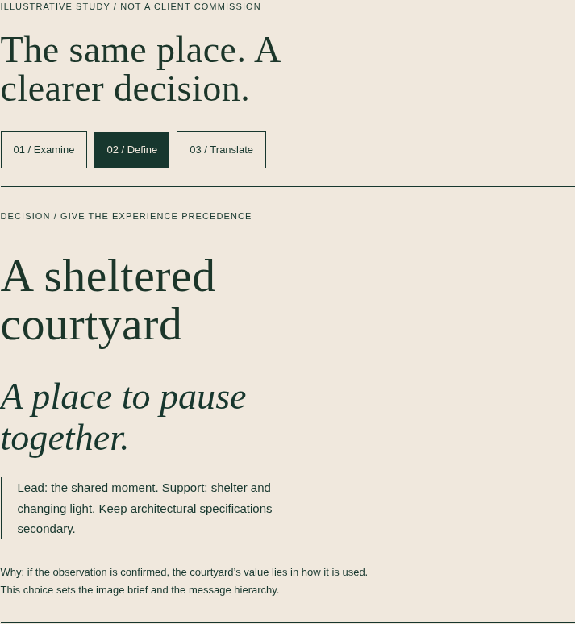
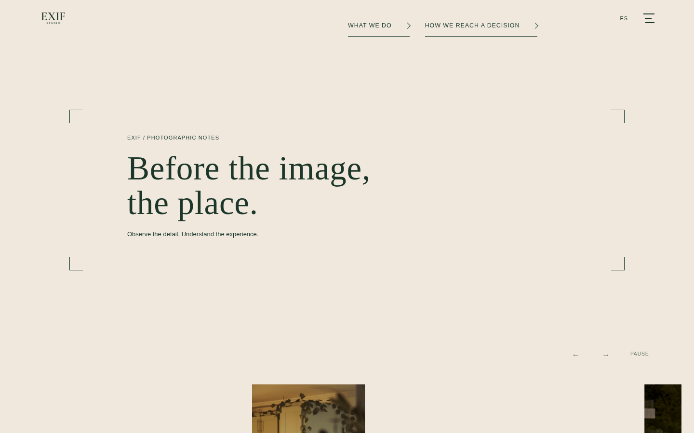

# EXIF interaction prototype review

Review material is committed on the implementation branch. No merge or deployment.

[Preservation inventory](EXIF-PROTECTED-COMPONENTS.md) · [Studio concept — approval required](EXIF-STUDIO-EDITORIAL-CONCEPT.md) · [Validation and limitations](EXIF-PROTOTYPE-VALIDATION.md) · [Exact changed files](CHANGED-FILES.txt)

## What We Do: one connected artifact

The courtyard is an illustrative study, not a client commission. Existing services and controls are preserved. Isolated artifact screenshots hide the fixed header only during capture; the full journey recordings retain the actual header.

| View | Examine | Define | Translate | Full interaction recording |
|---|---|---|---|---|
| 1440px EN | [Material](review/images/prototypes/1440-en-examine.png) | [Decision](review/images/prototypes/1440-en-define.png) | [Output](review/images/prototypes/1440-en-translate.png) | [Download MP4](https://raw.githubusercontent.com/pmtzk/exif-studio/feat/exif-interaction-prototypes-2026-10-09/docs/creative/review/videos/prototypes/1440-en-prototype-journey.mp4) |
| 1440px ES | [Material](review/images/prototypes/1440-es-examine.png) | [Decision](review/images/prototypes/1440-es-define.png) | [Output](review/images/prototypes/1440-es-translate.png) | [Download MP4](https://raw.githubusercontent.com/pmtzk/exif-studio/feat/exif-interaction-prototypes-2026-10-09/docs/creative/review/videos/prototypes/1440-es-prototype-journey.mp4) |
| 390px EN | [Material](review/images/prototypes/390-en-examine.png) | [Decision](review/images/prototypes/390-en-define.png) | [Output](review/images/prototypes/390-en-translate.png) | [Download MP4](https://raw.githubusercontent.com/pmtzk/exif-studio/feat/exif-interaction-prototypes-2026-10-09/docs/creative/review/videos/prototypes/390-en-prototype-journey.mp4) |
| 390px ES | [Material](review/images/prototypes/390-es-examine.png) | [Decision](review/images/prototypes/390-es-define.png) | [Output](review/images/prototypes/390-es-translate.png) | [Download MP4](https://raw.githubusercontent.com/pmtzk/exif-studio/feat/exif-interaction-prototypes-2026-10-09/docs/creative/review/videos/prototypes/390-es-prototype-journey.mp4) |

## Homepage passage: adjacent framing fallback

A bounded frame, short label and rule respond together to natural vertical scrolling. The original photographs and gallery controller are untouched. The same recordings above continue from the artifact into the passage, native scrolling and reduced motion.

| View | Entry | Midpoint | Open frame |
|---|---|---|---|
| 1440px EN | [Entry](review/images/prototypes/1440-en-passage-entry.png) | [Midpoint](review/images/prototypes/1440-en-passage-mid.png) | [Open](review/images/prototypes/1440-en-passage-open.png) |
| 1440px ES | [Entry](review/images/prototypes/1440-es-passage-entry.png) | [Midpoint](review/images/prototypes/1440-es-passage-mid.png) | [Open](review/images/prototypes/1440-es-passage-open.png) |
| 390px EN | [Entry](review/images/prototypes/390-en-passage-entry.png) | [Midpoint](review/images/prototypes/390-en-passage-mid.png) | [Open](review/images/prototypes/390-en-passage-open.png) |
| 390px ES | [Entry](review/images/prototypes/390-es-passage-entry.png) | [Midpoint](review/images/prototypes/390-es-passage-mid.png) | [Open](review/images/prototypes/390-es-passage-open.png) |

## Preservation evidence

[Baseline screenshot folder](review/images/baseline/) · [After screenshot folder](review/images/after/) · [Normalized component comparisons](review/images/normalized/) · [Pixel comparison results](review/normalized-visual-comparison.json)

| View | Checkpoint journey | Prototype journey |
|---|---|---|
| 1440px EN | [Download WebM](https://raw.githubusercontent.com/pmtzk/exif-studio/feat/exif-interaction-prototypes-2026-10-09/docs/creative/review/videos/baseline/1440-en-journey.webm) | [Download WebM](https://raw.githubusercontent.com/pmtzk/exif-studio/feat/exif-interaction-prototypes-2026-10-09/docs/creative/review/videos/after/1440-en-journey.webm) |
| 1440px ES | [Download WebM](https://raw.githubusercontent.com/pmtzk/exif-studio/feat/exif-interaction-prototypes-2026-10-09/docs/creative/review/videos/baseline/1440-es-journey.webm) | [Download WebM](https://raw.githubusercontent.com/pmtzk/exif-studio/feat/exif-interaction-prototypes-2026-10-09/docs/creative/review/videos/after/1440-es-journey.webm) |
| 390px EN | [Download WebM](https://raw.githubusercontent.com/pmtzk/exif-studio/feat/exif-interaction-prototypes-2026-10-09/docs/creative/review/videos/baseline/390-en-journey.webm) | [Download WebM](https://raw.githubusercontent.com/pmtzk/exif-studio/feat/exif-interaction-prototypes-2026-10-09/docs/creative/review/videos/after/390-en-journey.webm) |
| 390px ES | [Download WebM](https://raw.githubusercontent.com/pmtzk/exif-studio/feat/exif-interaction-prototypes-2026-10-09/docs/creative/review/videos/baseline/390-es-journey.webm) | [Download WebM](https://raw.githubusercontent.com/pmtzk/exif-studio/feat/exif-interaction-prototypes-2026-10-09/docs/creative/review/videos/after/390-es-journey.webm) |

All recordings are actual browser captures. The full preservation journeys include loader, hero, drawer, cards, rails, gallery pause/next/resume, Dear EXIF, service controls, Studio, founder letter and inquiry. External requests were blocked; form submission tests used mocks.

## Changed source

`index.html`, `expertise.html`, `assets/css/interaction-prototypes.css`, `assets/js/interaction-prototypes.js`, and `tests/interaction-prototypes.cjs`. Documentation and evidence are listed individually in the exact-file manifest. Existing CSS/controllers/media, Studio, routes, analytics and inquiry code are unchanged.
