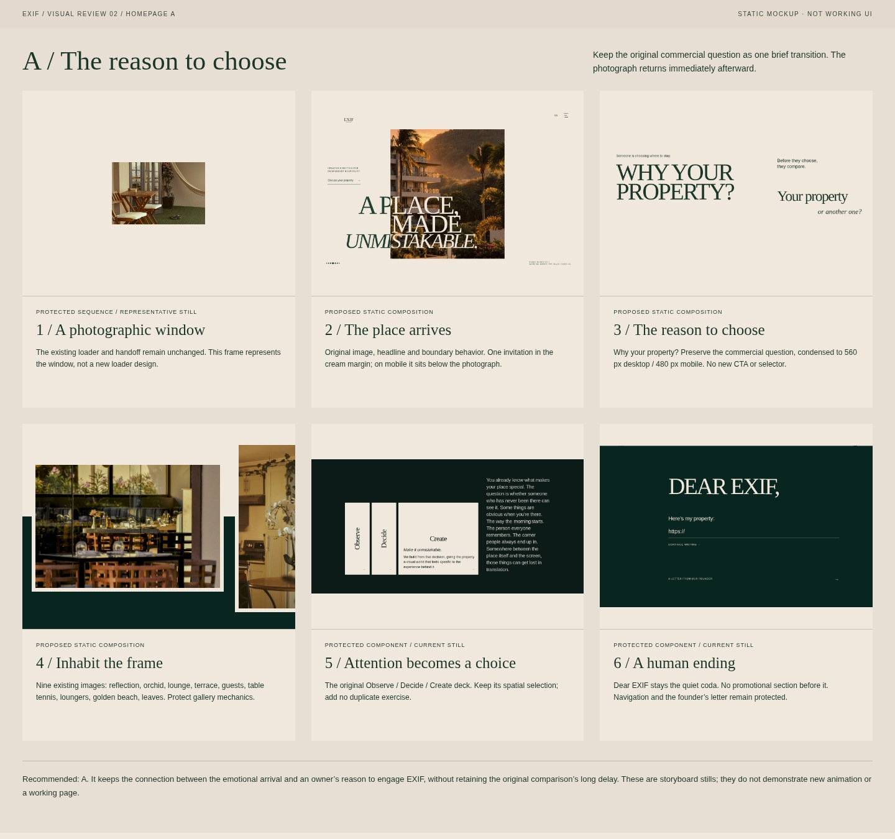
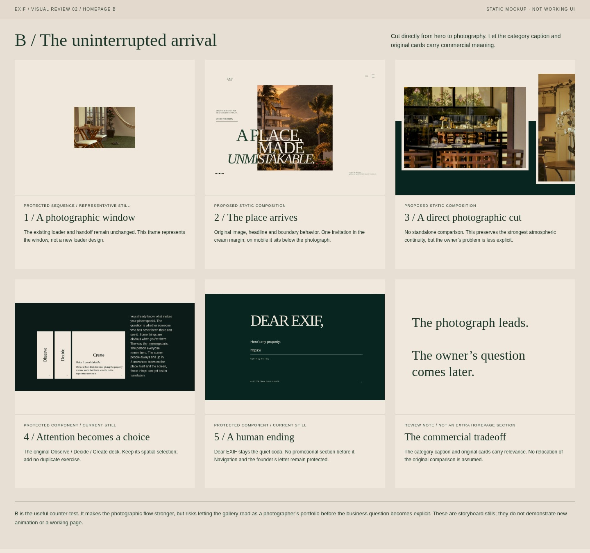
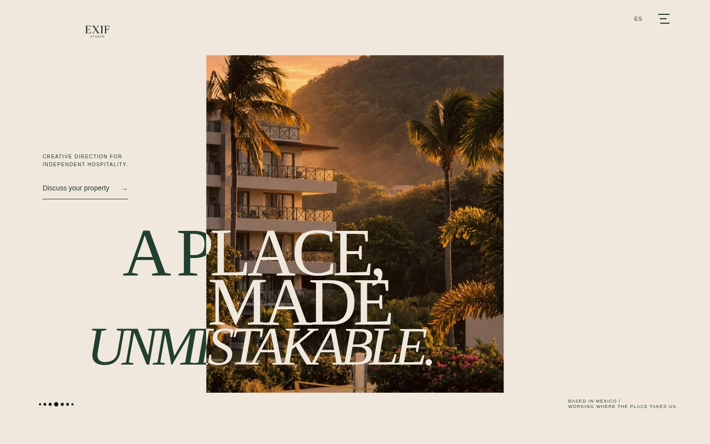
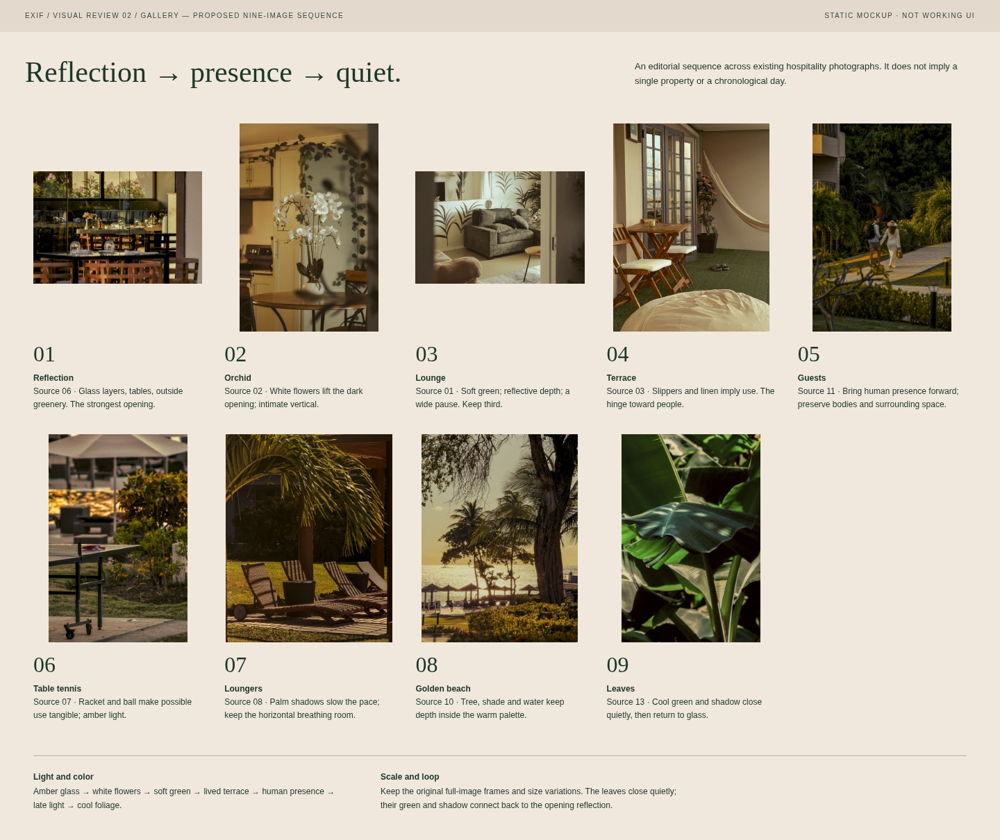
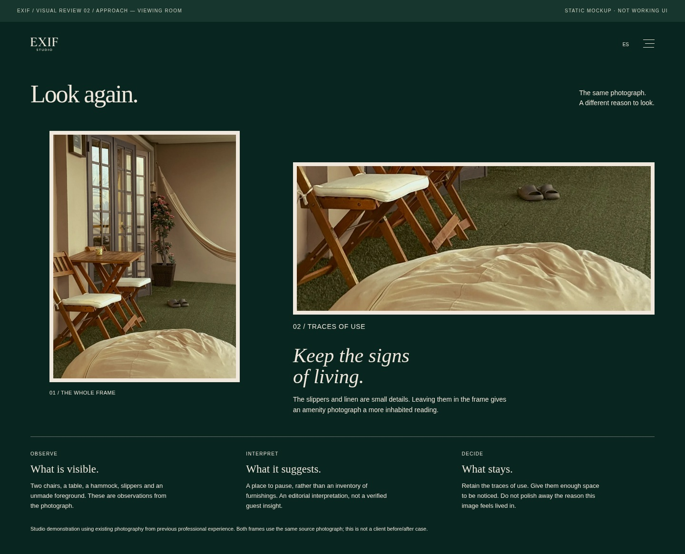
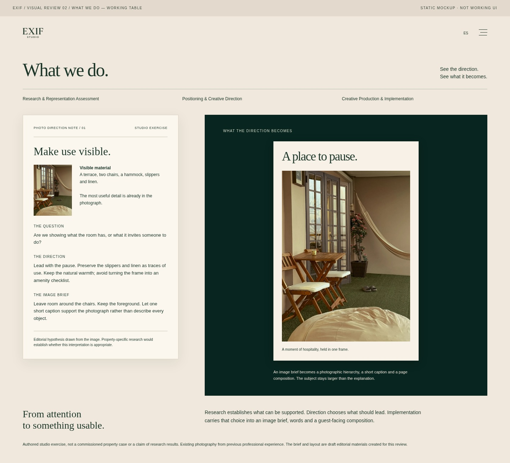

# EXIF — visual direction review 02

**Static mockups for approval. No website implementation, merge or deployment.**

[Download the 10-page visual deck (PDF)](https://raw.githubusercontent.com/pmtzk/exif-studio/feat/exif-interaction-prototypes-2026-10-09/docs/creative/visual-review-02/EXIF-VISUAL-DIRECTION-REVIEW-02.pdf) · [Download the complete offline packet (ZIP)](https://raw.githubusercontent.com/pmtzk/exif-studio/feat/exif-interaction-prototypes-2026-10-09/docs/creative/exif-visual-direction-review-02.zip)

Extract the ZIP and open `exif-visual-review-02/index.html`. All compositions are static; controls are inert.

## Two homepage alternatives

| A — The reason to choose **(recommended)** | B — The uninterrupted arrival |
| --- | --- |
|  |  |
| Loader → hero → short comparison → gallery → original cards → Dear EXIF. | Loader → hero → gallery → original cards → Dear EXIF. |

**Recommend A.** It preserves the bridge between atmosphere and an owner’s reason to choose. Keep four original statements; remove the repeated seconds/one-option explanation. Proposed footprint: **560 px desktop / 480 px mobile**, versus the original’s **2,514 / 1,616 px**. No additional CTA.

B has the strongest uninterrupted atmosphere, but defers the commercial question and more readily reads as a photographic portfolio. [Compare original / short / omitted](images/bridge-comparison.jpg). The restored hero and gallery edit stay constant across this test. **Neither alternative automatically relocates the original comparison.** Shortening its copy/spacing remains a proposal, not an implementation.

Full pacing montages: [A desktop](images/homepage-a-desktop.jpg) · [B desktop](images/homepage-b-desktop.jpg) · [A mobile](images/homepage-a-mobile.jpg) · [B mobile](images/homepage-b-mobile.jpg). Montages concatenate stills; they are not runnable page layouts or measured deployment previews.

## The exact restored hero

[Desktop, 1440 × 900](images/hero-desktop-en.jpg) · [Mobile EN, 390 × 844 + invitation strip](images/hero-mobile-en.jpg) · [Mobile ES](images/hero-mobile-es.jpg) · [360 px EN](images/hero-mobile-small-en.jpg) · [360 px ES](images/hero-mobile-small-es.jpg)

Desktop: the single invitation occupies the original cream margin, **x ≈ 86, y 310–404**. The photographic frame and headline keep their geometry.

Mobile: a **136 px cream strip below the full photographic first screen** holds the invitation. No overlay or raised headline. EN/ES at 390 and 360 widths are **pixel-identical to the protected first viewport**; [lossless comparison](hero-preservation.json).

## A photographic edit, not a new gallery system

[All 13 actual source photographs and keep/reserve judgments](images/gallery-sources.jpg) · [Proposed nine-image edit](images/gallery-edit.jpg) · [Edit in the existing frame system](images/gallery-edit-desktop.png)

**06 reflection → 02 orchid → 01 lounge → 03 terrace → 11 guests → 07 table tennis → 08 loungers → 10 golden beach → 13 leaves.**

The reflection opens with layered seeing; orchids lift the exposure; the lounge supplies a wide pause. Terrace details lead into human presence earlier. Play and palm shadows continue that inhabited reading. Golden beach holds the warm depth; cool leaves close and reconnect to the reflection.

Reserve **04 restaurant** (graphic face/repeated dining), **05 basketball** (second sports detail), **09 sunset** (repeated climax) and **12 pool overview** (blue reset/generic overview). Nothing is deleted. Preserve full-image ratios, varied frames, cream mats, green rise and current controls. This is an edit across previous professional photography, not a chronological tour of one property.

## Two concrete inner-page compositions

| Approach — viewing room | What We Do — working table |
| --- | --- |
|  |  |
| The existing terrace photograph appears whole and enlarged around slippers/linen. The detail makes an editorial judgment visible: retain signs of living. | An authored photographic brief sits beside the resulting image-led communication. The visitor sees an actual note and a tangible layout, not another word selector. |

[Approach mobile](images/approach-mobile.jpg) · [What We Do mobile](images/what-we-do-mobile.jpg). What We Do shows the output before its supporting document on mobile.

**Created now:** [draft photographic direction note](materials/PHOTO-DIRECTION-NOTE-01.md), caption and illustrative layout, all using existing photograph `03`. The two pages show observation and its resulting work. No placeholders or word-only selectors. The detail crop belongs to the mockup; the source photograph is unchanged.

**Needed before production:** approved EN/ES copy and additional inner-page image-use permission. A genuine service case requires actual property research, an approved brief, source contact sheet and delivered output; those materials are absent. These drafts must remain labeled studio exercises. No new photograph is needed to approve the compositions.

## Protection and evidence boundary

All **76 recorded website files remain unchanged**, including loader, hero behavior, gallery code, navigation, routing and founder’s letter. [Protection record](protection-record.json) · [Capture record](capture-record.json) · [Render record](render-record.json).

These are Chromium-rendered mockups and frozen comparison states, not new interaction tests or Safari verification. The nine-image edit was applied only to an isolated browser DOM; future reduced-count mechanics remain unverified. External HTTPS/fonts were blocked equally in the original-archive comparisons. Full source images are unchanged; no AI-generated photography or color grading was used.
